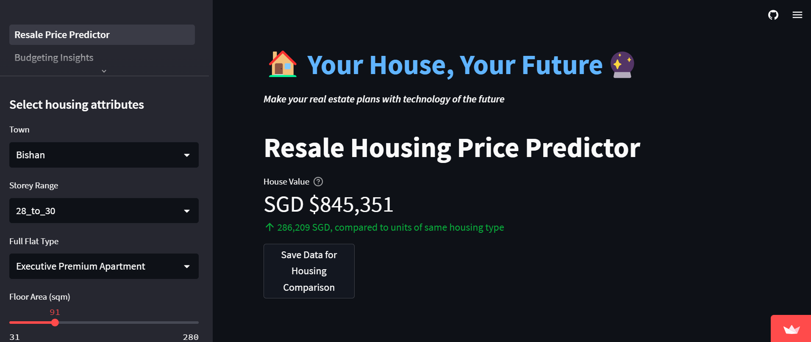
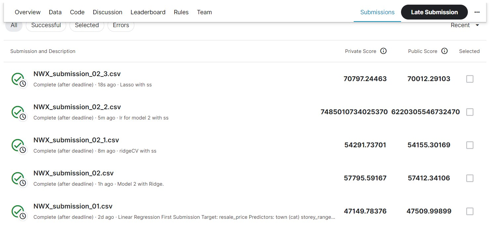

#  Project 2: Singapore Housing Data

### **Try Out our Housing Price Predictor Streamlit App by clicking the link below.**
### [HDB Resale Price Predictor Application with 11 Most Important Factors](https://your-house-your-future-resale-price-predictor.streamlit.app/)

 

## Content Directory:
- [Background and Problem Statement](#background)
- [Datasets Used](#datasets-used)
- [Feature Engineering](#feature-engineering)
- [Exploratory Data Analysis](#brief-description-of-our-data-exploration)
- [Modeling](#summary-of-feature-selection-from-each-model)
- [Kaggle Submission](#kaggle-submission)
- [Key Insights & Recommendations](#key-insights)

 

## Background
In Singapore's dynamic housing market, the resale prices of public housing flats (HDB flats) are influenced by a myriad of factors including flat characteristics, nearby amenities, socio-economic variables and more. Accurate prediction of HDB flat resale prices is of significant importance to buyers, sellers, and policy-makers alike, for informed decision-making and planning.

Abstracting a dataset comprising a variety of features such as transaction year, town, flat type, block number, street name, storey range, floor area, flat model, lease commence date, and other socio-economic and locational variables, the task aims to ease the real estate decision making process through designing and deploying a predictive model that accurately predict the resale price of HDB flat.

 

## Problem Statement
We are a real estate start-up company in Singapore and we are addressing to a house buyer/seller.

 HDB resale flat prices span a big range and seem to be influenced by different features of the flat. The general public may not be well-equipped with the information needed to aid their Real Estate decision making process. We have decided to develop a product where the general public can check the predicted HDB resale flat pricing, and answer common questions such as:
1. What are the available options given my current budget?
2. Which flat types and where can I afford as a buyer?
3. What price should I set when I sell my flat?
4. How to market my flat to increase its selling price?

 
 

---

### Datasets Used:
* [`train.csv`](../datasets/train.csv): A dataset with over 77 columns of different features relating to HDB flats, for resale transactions taking place from Mar 2012 to Apr 2021.
* [`pri_sch_popularity.csv`](../datasets/pri_sch_popularity.csv): [Primary School Popularity dataset](https://schlah.com/primary-schools) contains schools ranked based on Popularity in Primary 1 (P1) Registration.

 

### Brief Description of Our Data Exploration
Upon studying the datasets, we found out that these are the most important 10 factors that affects the housing price are given as below. Starting from the most important factor, we have floor area per square feet, max floor level and lease commence date.
 

 

We went further and engineered some additional features to assist us in building the most accurate model and summarised in the data dictionary below.
 

## Data Dictionary
The data dictionary for the columns found in train.csv can be found at this [kaggle link](https://www.kaggle.com/competitions/dsi-sg-project-2-regression-challenge-hdb-price/data).

## Feature Engineering
Additionally we have added the following features:

| Feature | Type | Dataset | Description |
| :--- | :--- | :--- | :---|
| pop_ranking | int64 | pri_sch_popularity | Primary School ranking based on P1 registration popularity |
| pop_ranking_2cat | int | na | Primary School ranking split into 2 tiers - top 8 schools are Cat 1 and the reamaining are Cat 2 |
| postal_sector | object | na | First 2 characters of the 'postal' column is its [postal sector](https://www.mingproperty.sg/singapore-district-code/) | 
| housing_region | object | na | Housing regions of Core Central Region (CCR), Rest of Central Region (RCR), and Outside Central Region (OCR), [as defined by the Urban Redevelopment Authority](https://www.redbrick.sg/blog/singapore-districts-and-regions/), were assigned to each flat based on its postal sector. | 
---

 
 

## Summary of Feature Selection from Each Model
We did 3 different models - **Linear, Lasso and Ridge Regression Models** for Model 1, Model 2 and Model 3 respectively.

 

| Model | Feature Selection Description |
|---|---|
| Baseline | (1) model runs with all numeric features   (2) Used as a baseline to evaluate model performance | 
| Model 1 | (1) Feature selection based on domain knowledge  (2) Elements that are known to affect housing prices | 
| Model 2 | (1) The features selection are based on features correlation  (2) Feature engineering of region against flat types  (3) Popularity ranking of primary schools  (4) Availability of amenities |
| Model 3 |(1) Feature selection based on model 1 features and  (2) Feature importance from previous models| 

 
 

## Summary of Model

|  | Baseline Model | Model 1 | Model 2 | Model 3 | **Chosen Model** |
|---|---|---|---|---|---|
| R Squared (train) | 0.8638 | 0.8911 | 0.9147 | 0.8917 | **0.8911** |
| R Squared (test) | 0.8617 | 0.8904 | 0.9137 | 0.8920 | **0.8904** |
| RMSE (internal test) | 52,965.62 | 47,162.25 | 41,837.78 | 46,806.20 | **47,162.25** |
| RMSE (external tested with data from Kaggle) | NA | 47,149.78 | 47,509.99 | 55,781.83 | **47,149.78** |

---

 
 

## Kaggle Submission
Our best model has attained a ~48,000 RMSE with our prediction.

 

---

## Key Insights
The following features were found to have the greatest impact on the model we have built:

* Town
* Storey Range
* Full Flat Type
* Pri Sch Name
* Floor Area SQM
* Lease Commencement Date
* MRT Nearest Distance
* Hawker Nearest Distance
* Mall Nearest Distance
* Pri Sch Nearest Distance

## Recommendations

* Recommendations for Buyers: 
	* Know your available options given your budget
	* Prioritize and personalize your wants
	* Quality home with comfortable price

* Recommendations for Sellers:
	* Appraise your property value based on market valuation
	* Pivot your selling strategies
	* Match your property’s unique selling points to the right buyers

---
## Reference
(1) The impact of cooling measures: How HDB resale prices have changed in every Singapore town  
https://www.channelnewsasia.com/singapore/cooling-measures-singapore-hdb-resale-prices-towns-property-map-3499961#:~:text=Analysts%20expect%20a%20one%2Ddigit,12.7%20per%20cent%20in%202021.

(2) Singapore Cooling Measures - History of cooling measures   https://stackedhomes.com/editorial/singapore-cooling-measures-history

(3) Mapview of URA Planning Area
  https://www.ura.gov.sg/-/media/Corporate/Property/REALIS/realis-maps/map_ccr.pdf

(4) HDB Property Prices Near Popular Primary Schools: Do They Really Cost More?
  https://dollarsandsense.sg/hdb-property-prices-near-popular-primary-schools-really-cost/

(5) The URA Property Price Index (PPI) has an upward trend across the years from 2001 to 2019
  https://darrenong.sg/blog/is-it-profitable-to-buy-property-during-a-crisis/amp/

(6) Home sale and rental prices may rise after changes to P1 registration: Property experts
  https://www.straitstimes.com/singapore/parenting-education/home-sale-and-rental-prices-may-rise-after-changes-to-p1-registration

(7) Primary School Rankings in Singapore 2020
  https://schlah.com/primary-schools